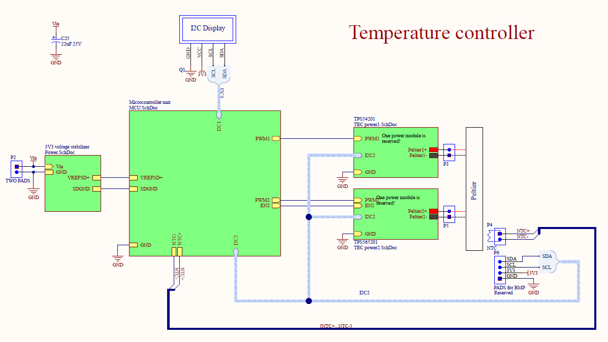

# Temperature controller (PID controller)

This is a temperature stabilizer for thermoelectric cooler (Peltier module) or ceramic heater modul based on STM32F3 microprocessor and buck converter. The repository consist from a project of **Schematic** and **PCB design** files made in Altium Designer. All parts includes LCSC part number ready for manufacturing with JLCPCB.

See also:
[Temperature Controller firmware](https://github.com/norbertg1/Temperature_Controller-FW)
[Temperature Controller software](https://github.com/norbertg1/Temperature_Controller-SW)

**Features:**
 - 1.5 A and 5 A output current
 - Various NTC, PTC temp. sensor support
 - 16 bit ADC for temp. sensor
 - I2C temp. sensor support (BMP280, etc..)
 - Current, voltage and power sense for both outputs
 - PID loop
 - STM32F373
 - Vref with LM4041 1.225 V for better temp. sensing
 - OLED screen
 - Control over serial port with PC

### Block schematic:

 
 
### Use case

Original purpose for this project was cooling or heating and very precise stabilizing radiation detector and preamp input FET temperature, but its can be reused for anything else where the cooling or heating power is enough.

### Output power

The circuit is designed with two outputs:
 - **TPS54200**
Maximum output current is 1.5 A. Use this for less cooling power required applications, with more precious temp. control.
 - **TPS56201**
Maximum output current is 5 A. For utilizing the whole amount of this current need to replace the inductor with bigger one, with this one the maximum current is about somewhere 2-3 A.See datasheets and parameters.xlsx for exact components.

All the two ouputs are equiped with current sense shunt and current sense amplifier (INA226) communicating through I2C.

### Temperature sensing

Two options:
 - **BMP280:** Fully digital readout over I2C. Disadvantage is that you need 4 wires, and maximum and minimum values are determined by datasheet (-40 °C and 85 °C).

 - **PTC, NTC:** Precise 1.225 V is produced by IC for Vref and for power Rx and NTC modules. Differential ADC used for mesure the voltage of Rx and NTC modules. From the included temperature vs. resistance (R-T) table the temperature can be determined.
Also any part can be used that withstand the temperature and the R-T curve is known or measured.

### Programming

Programming through SWD connector with STlink v2:\

SWDIO — SWDIO\
SWCLK — SWCLK\
GND — GND

### Control loop
In very short:\
Read the temperature --> calculate the error from desired temp --> adjust the output power\
For software see the [related repository](https://github.com/xnorbi/Temperature_Controller-SW).

### Assembled PCB

